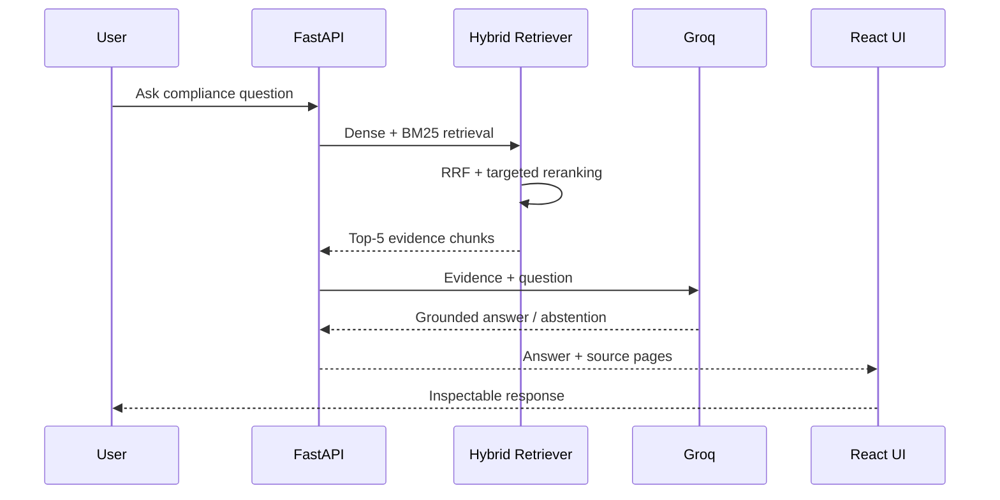
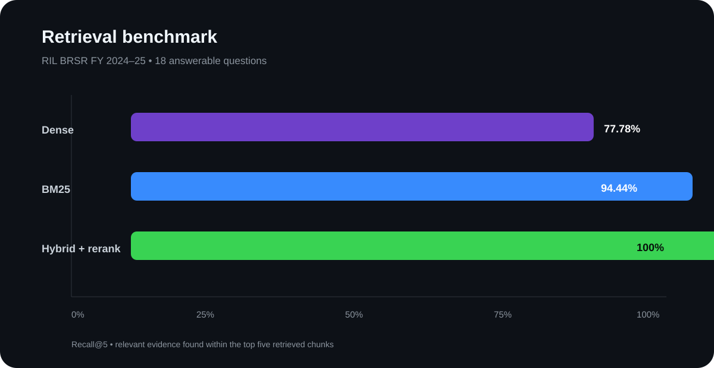
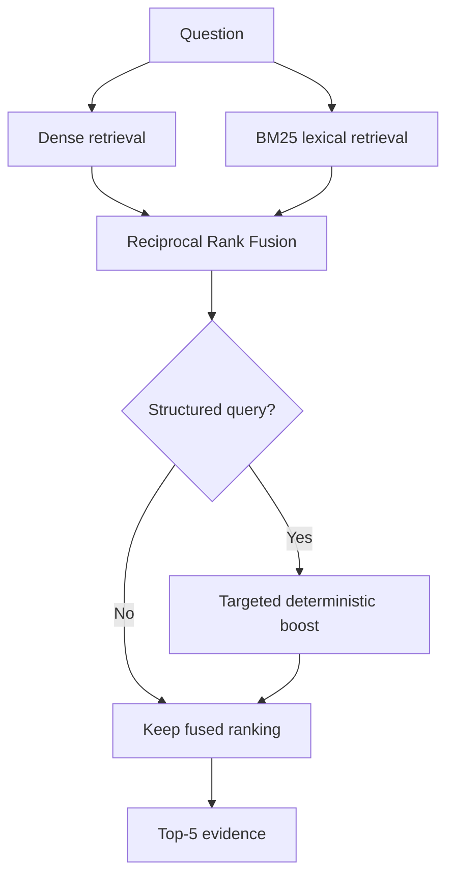
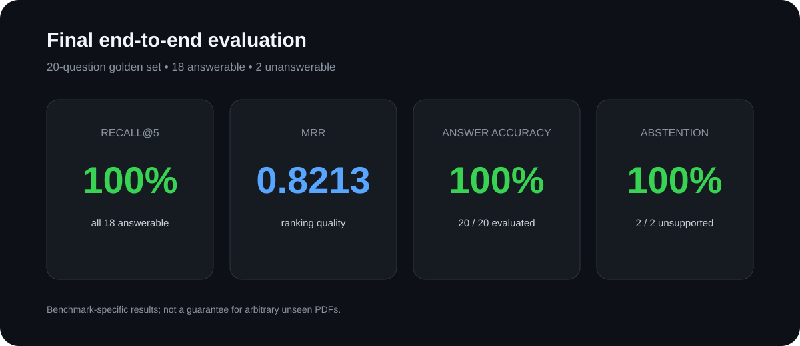

<div align="center">

# ⚡ RAG Compliance Copilot

### Evidence-grounded question answering for BRSR / ESG reports

**Upload a report → retrieve the right evidence → generate a grounded answer → inspect the source**

<p>
  
  
  
  
</p>

<p>
  <a href="https://rag-frontend-75wd.vercel.app">Live Demo</a>
  ·
  <a href="#architecture">Architecture</a>
  ·
  <a href="#evaluation">Evaluation</a>
  ·
  <a href="docs/PROJECT_REPORT.md">Project Report</a>
  ·
  <a href="docs/EVALUATION.md">Evaluation Methodology</a>
</p>

</div>

> [!IMPORTANT]
> **Final benchmark:** 20 questions • 18 answerable • 2 unanswerable • **100% Recall@5 • 0.8213 MRR • 100% answer accuracy • 100% abstention accuracy**.
>
> These metrics are specific to the **RIL BRSR FY 2024–25** golden dataset and are not presented as a guarantee for arbitrary unseen PDFs.

---

## ✦ What this project is

RAG Compliance Copilot is a full-stack, evidence-grounded RAG system for querying large compliance and ESG reports.

Instead of treating the LLM as the source of truth, the system explicitly separates:

**retrieval → evidence selection → grounded generation → source inspection**

It is built to handle the details that make compliance documents difficult to query reliably:

- exact numerical values
- reporting-year disambiguation
- table-heavy content
- page-level traceability
- document-level filtering
- unsupported questions and abstention

---

## 🧭 Architecture

GitHub renders Mermaid diagrams directly inside Markdown, so the architecture below is interactive and remains close to the implementation. citeturn0search1turn0search0

### End-to-end system

```mermaid
flowchart LR
    U["👤 User"] --> FE["⚛️ React + Vite"]
    FE --> API["⚡ FastAPI"]

    API --> ING["📄 PDF Ingestion"]
    ING --> EXT["Page-aware extraction"]
    EXT --> CH["Chunking + metadata"]
    CH --> EMB["MiniLM embeddings"]
    EMB --> QD[("Qdrant")]

    API --> DR["Dense retrieval"]
    API --> BM["BM25 retrieval"]

    QD --> DR
    CH --> BM

    DR --> RRF["RRF fusion"]
    BM --> RRF
    RRF --> RR["Targeted structured reranking"]
    RR --> TOP["Top-5 evidence"]
    TOP --> LLM["Groq LLM"]
    LLM --> OUT["Grounded answer / abstention"]
    TOP --> SRC["📑 Page-level sources"]

    OUT --> FE
    SRC --> FE

    classDef app fill:#161b22,stroke:#58a6ff,color:#f0f6fc;
    classDef retrieval fill:#161b22,stroke:#6e40c9,color:#f0f6fc;
    classDef safe fill:#161b22,stroke:#39d353,color:#f0f6fc;
    class U,FE,API,ING,EXT,CH,EMB,QD app;
    class DR,BM,RRF,RR,TOP retrieval;
    class LLM,OUT,SRC safe;
```



### Query path



---

## 🔬 Retrieval engineering

The project deliberately compares retrieval strategies instead of assuming semantic search is sufficient.

| Strategy | Strength | Recall@5 | MRR |
|---|---|---:|---:|
| **Dense** | Semantic similarity / paraphrases | 77.78% | 0.7222 |
| **BM25** | Exact terminology / table labels | 94.44% | **0.8352** |
| **Hybrid + structured reranking** | Coverage + structured evidence | **100.00%** | 0.8213 |



### Why hybrid?



**Design principle:** dense retrieval handles meaning; BM25 handles exact wording; RRF combines ranked evidence; the narrow structured reranker addresses table-heavy female-representation queries without changing unrelated query behavior.

---

## 📊 Final evaluation



### Evaluation matrix

| Dimension | Dataset | Result | What it demonstrates |
|---|---|---:|---|
| Retrieval coverage | 18 answerable | **100% Recall@5** | Required evidence reached the generator |
| Ranking | 18 answerable | **0.8213 MRR** | Relevant evidence generally ranks highly |
| Answer generation | 20 total | **100%** | Expected answers matched evaluator outcomes |
| Abstention | 2 unsupported | **100%** | Unsupported questions were rejected correctly |

### The two safety cases

| Query type | Expected system behavior | Final result |
|---|---|---|
| Information present in report | Retrieve evidence → answer | ✅ Correct |
| Information absent from report | Do not invent → abstain | ✅ Correct |

The final run also included deliberately unsupported questions such as fictional moon-mining revenue and Mars exploration missions. Both produced correct abstention outcomes in the evaluator.

> [!NOTE]
> **Accuracy scope matters.** The benchmark is intentionally tied to one corpus: RIL BRSR FY 2024–25. A new PDF can be ingested through the same pipeline, but its accuracy should be established with a new evaluation set.

---

## 🧱 System components

| Layer | Implementation | Responsibility |
|---|---|---|
| **Frontend** | React + Vite + CSS | Upload, query, source inspection |
| **API** | FastAPI | Validation, orchestration, REST interface |
| **PDF** | pypdf | Page-aware text extraction |
| **Embeddings** | all-MiniLM-L6-v2 | Dense semantic representation |
| **Vector DB** | Qdrant | Vector search + metadata filtering |
| **Lexical** | rank-bm25 | Exact-term retrieval |
| **Fusion** | RRF | Combine dense + lexical rankings |
| **Reranking** | Deterministic structured boost | Table-focused retrieval |
| **LLM** | Groq | Grounded response generation |
| **Deployment** | Render + Vercel | Production hosting |

---

## 🛡️ Reliability and defensive engineering

The system is designed around failure modes, not just the happy path.

| Failure mode | Backend behavior |
|---|---|
| Non-PDF upload | ❌ Reject with validation error |
| File > 100 MB | ❌ Reject with 413 |
| Corrupt PDF | ❌ Reject with clear 422 |
| No extractable text | ❌ Reject with clear 422 |
| No searchable chunks | ❌ Reject with clear 422 |
| Empty/invalid question | ❌ Reject with validation error |
| Retrieval failure | ❌ Return service error |
| LLM failure | ❌ Return service error |
| Unsupported question | ✅ Explicit abstention |

### Evidence model

Every retrieved chunk carries:

```text
document_id
document_name
page_start
page_end
chunk_id
source_text
retrieval_score
```

That metadata is surfaced back to the UI so the user can inspect **where an answer came from**.

---

## 🚀 Product workflow


### Supported workflow

- 📄 Upload a text-based PDF
- 🗂️ Select an indexed document
- 🔎 Ask a compliance question
- 🧠 Retrieve evidence using hybrid search
- 📌 Inspect source pages/chunks
- 🛑 Receive an abstention when evidence is insufficient
- 🗑️ Delete indexed documents

---

## 🧪 Reproducible evaluation

The repository contains:

```text
evaluation/
├── golden_questions.json
├── run_evaluation.py
├── benchmark_retrieval.py
└── results/
    └── latest_results.json
```

Run the full benchmark:

```powershell
python evaluation\\run_evaluation.py
```

Run retrieval-only experiments without calling the LLM:

```powershell
python evaluation\\benchmark_retrieval.py
```

The detailed evaluation methodology and project report are maintained separately so the README remains a high-signal project overview.

---

## 🌐 Deployment

| Service | URL |
|---|---|
| **Frontend** | https://rag-frontend-75wd.vercel.app |
| **Backend** | https://rag-compliance-copilot-1.onrender.com |
| **Health** | https://rag-compliance-copilot-1.onrender.com/health |

> [!TIP]
> The production frontend and backend are separate deployments. The frontend communicates with the FastAPI API through `VITE_API_URL`.

---

## ⚙️ Local development

### Backend

```powershell
cd rag-compliance-copilot
python -m compileall -q .
uvicorn main:app --reload
```

Health check:

```powershell
Invoke-RestMethod http://localhost:8000/health
```

### Frontend

```powershell
cd rag-frontend
npm install
npm run dev
```

Open `http://localhost:5173`.

---

## 📡 API surface

| Endpoint | Method | Purpose |
|---|---|---|
| `/health` | GET | Service health |
| `/documents` | GET | List indexed documents |
| `/ingest` | POST | Upload and index PDF |
| `/documents/{document_id}` | DELETE | Delete document + chunks |
| `/query` | POST | Retrieve evidence + generate answer |

---

## 📁 Documentation

| Document | Purpose |
|---|---|
| [Architecture](docs/ARCHITECTURE.md) | System design + deployment architecture |
| [Workflow](docs/WORKFLOW.md) | End-to-end operational flow |
| [Retrieval Pipeline](docs/RETRIEVAL_PIPELINE.md) | Dense/BM25/RRF/reranking details |
| [Evaluation](docs/EVALUATION.md) | Dataset, metrics, final results |
| [Project Report](docs/PROJECT_REPORT.md) | Full project write-up |

---

## 🎯 Engineering highlights

- **Page-aware ingestion** rather than blind text splitting
- **Hybrid retrieval** rather than vector-only search
- **RRF fusion** rather than raw-score mixing
- **Targeted structured reranking** for table-heavy queries
- **Explicit abstention** rather than forced answers
- **Document-level filtering and deletion**
- **100 MB upload guardrail**
- **Backend error hardening**
- **Automated golden-set evaluation**
- **Production deployment**
- **Source traceability throughout the answer path**

---

## ⚠️ Known limitations

- Current extraction is optimized for text-based PDFs.
- Scanned/image-only PDFs are rejected; OCR is future scope.
- The golden benchmark covers one BRSR report.
- Broader multi-company and multi-year evaluation is still required.
- Retrieval scores are ranking signals, not probabilities.
- The reported 100% answer accuracy is specific to the project's expected-answer matching logic and benchmark; it is not a claim of universal factual accuracy.

---

## 🗺️ Project maturity

```text
M1 Core RAG             ████████████████████  COMPLETE
M2 Evidence grounding  ████████████████████  COMPLETE
M3 Retrieval            ████████████████████  COMPLETE
M4 Application          ████████████████████  COMPLETE
M5 Hardening            ████████████████████  COMPLETE
M6 Evaluation           ████████████████████  COMPLETE
M7 Documentation        ████████████████████  COMPLETE
```

**Status: implementation + deployment + evaluation + documentation complete.**

---

<div align="center">

### Built as an engineering system, not just an LLM demo.

**Retrieve. Ground. Verify. Abstain when evidence is missing.**

</div>
