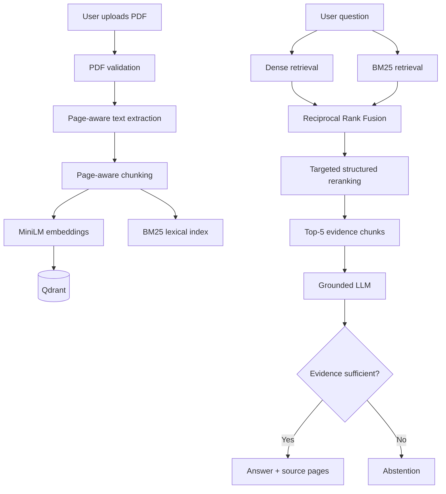

# System Architecture

## 1. Overview

RAG Compliance Copilot is a document-grounded question-answering system for BRSR/ESG reports. The architecture separates document ingestion, retrieval, ranking, and generation so each stage can be tested independently.

## 2. End-to-end architecture



## 3. Ingestion pipeline

1. Validate that the uploaded file is a PDF and does not exceed **100 MB**.
2. Extract text page by page using pypdf.
3. Reject PDFs with no extractable text.
4. Split each page into overlapping word-based chunks.
5. Preserve document and page metadata with every chunk.
6. Generate sentence-transformers/all-MiniLM-L6-v2 embeddings.
7. Store vectors and metadata in Qdrant.
8. Maintain document-level identifiers so individual reports can be queried or deleted independently.

## 4. Retrieval pipeline

The query is sent through two complementary retrieval paths:

- **Dense retrieval:** captures semantic similarity and paraphrased questions.
- **BM25:** captures exact terminology, table labels, identifiers, and numerical expressions.

The ranked lists are combined using **Reciprocal Rank Fusion (RRF)** rather than directly adding raw dense and BM25 scores. A targeted deterministic reranking signal is then applied only to a narrow class of structured percentage questions where the query explicitly asks for female representation in the Board of Directors or Key Management Personnel.

The final five chunks are passed to the generator.

## 5. Generation and abstention

The generator receives only the retrieved report context and the user question. The prompt requires:

- exact preservation of supported numerical values;
- correct reporting-year and table-row selection;
- no outside knowledge or unsupported inference;
- abstention when the supplied context does not support the requested answer.

The API returns the answer together with document and page metadata for each retrieved source.

## 6. Deployment

```text
React + Vite
      |
      v
   Vercel
      |
      | HTTPS
      v
FastAPI backend
      |
      +--> Hugging Face embeddings
      +--> Qdrant Cloud
      +--> Groq LLM
```

## 7. API surface

| Endpoint | Purpose |
|---|---|
| GET /health | Health check |
| GET /documents | List indexed documents |
| POST /ingest | Validate, parse, chunk, embed, and store a PDF |
| DELETE /documents/{document_id} | Delete a document and its indexed chunks |
| POST /query | Retrieve evidence and generate a grounded answer |

## 8. Design rationale

The architecture prioritizes traceability and retrieval quality for compliance-style documents. Page metadata makes evidence auditable, hybrid retrieval handles both semantic and exact-match queries, and abstention prevents the generator from presenting unsupported information as fact.

## 9. Limitations

- Scanned/image-only PDFs are not supported because the current extraction path is text-based.
- The golden evaluation dataset is currently based on one BRSR report.
- Retrieval scores are ranking signals and should not be interpreted as probabilities.
- Full end-to-end evaluation depends on available LLM quota.
